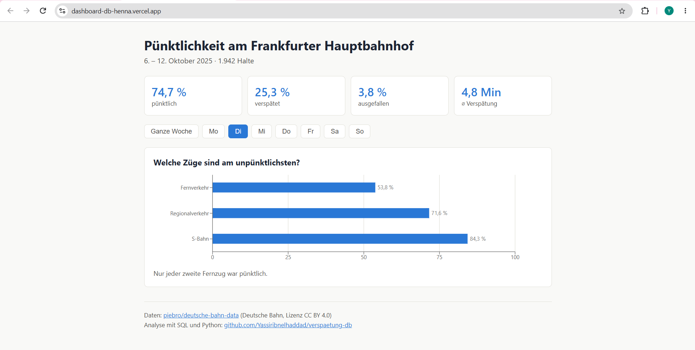

# Dashboard zur Zugpünktlichkeit

Ein kleines Dashboard, das die Ergebnisse meiner Datenanalyse zeigt: Wie pünktlich sind die Züge am Frankfurt (Main) Hbf?

**Live:** https://dashboard-db-henna.vercel.app



## Daten

- Zeitraum 1: Montag, 6. bis Sonntag, 12. Oktober 2025 (13.055 Halte)
- Zeitraum 2: Montag, 3. bis Sonntag, 9. August 2026 (12.494 Halte)
- Alle Halte am Frankfurt (Main) Hbf
- Quelle: [piebro/deutsche-bahn-data](https://huggingface.co/datasets/piebro/deutsche-bahn-data) (Deutsche Bahn, Lizenz CC BY 4.0)

Die Daten habe ich mit SQL und Python analysiert und als JSON exportiert. Die Analyse liegt in diesem Projekt: [verspaetung-db](https://github.com/Yassiribnelhaddad/verspaetung-db)

## Funktionen

- Vier Kennzahlen: pünktlich, verspätet, ausgefallen und mittlere Verspätung
- Diagramm mit der Pünktlichkeit nach Zuggruppe (Fernverkehr, Regional, S-Bahn)
- Filter nach Wochentag: Die Kennzahlen und das Diagramm ändern sich mit
- Umschalten zwischen zwei Zeiträumen: Oktober 2025 und August 2026


## Was ich benutzt habe:

React, Vite, Recharts, Vercel

## Projekt starten

```
npm install
npm run dev
```

## Was ich gelernt habe

- Daten aus SQL als JSON exportieren und im Frontend laden
- Zustand mit React verwalten (`useState`, `useEffect`)
- Diagramme mit Recharts bauen
- Eine Seite mit Vercel veröffentlichen
